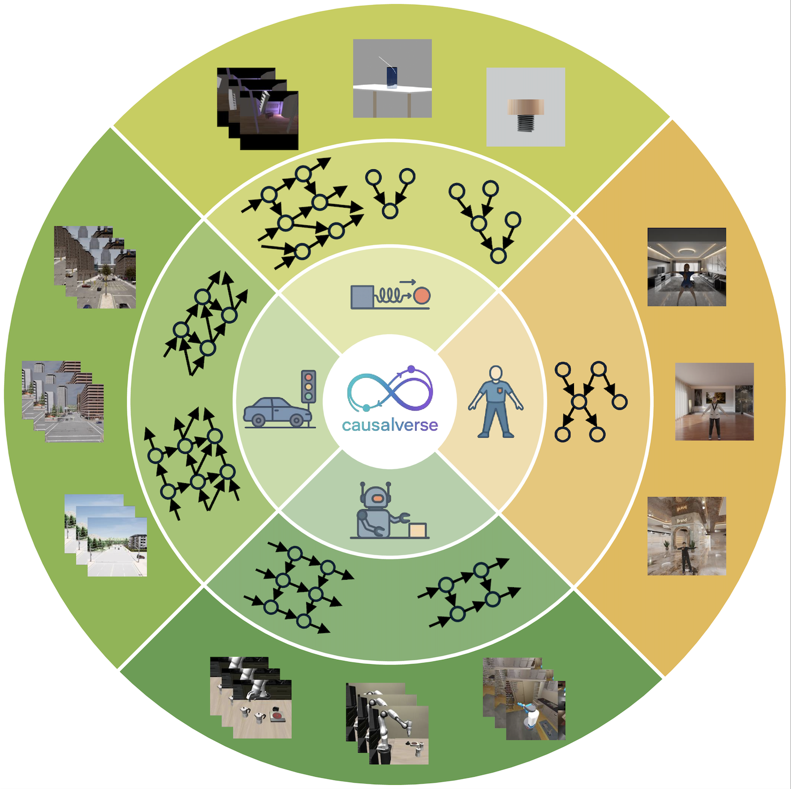
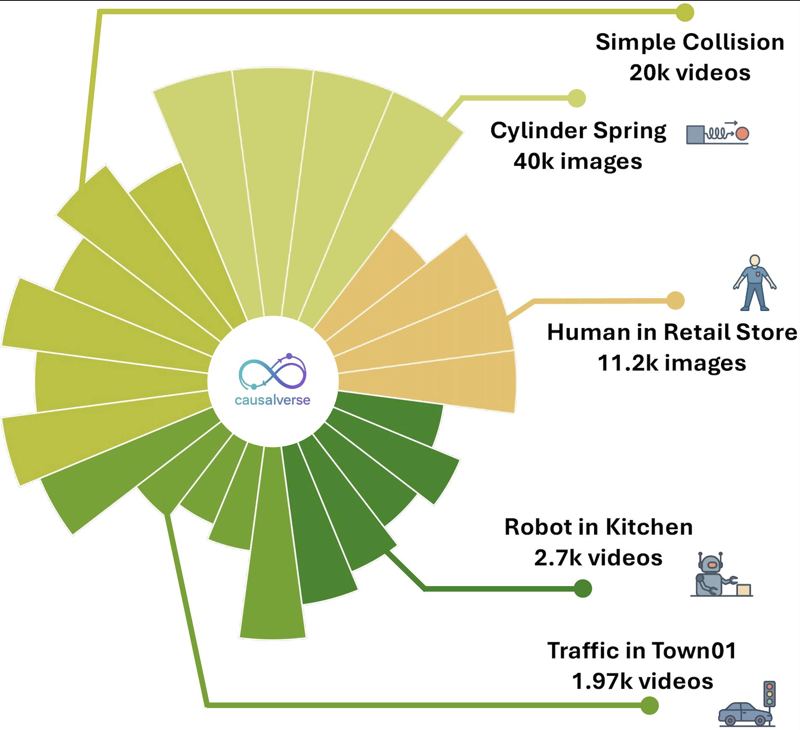

# CausalVerse: Benchmarking Causal Representation Learning with Configurable High-Fidelity Simulations


<p align="center">
  <a href="https://huggingface.co/CausalVerse">
    
  </a>
  <a href="https://huggingface.co/datasets/CausalVerse/CausalVerse_Image">
    
  </a>
  
  
  
</p>

---

## 🔎 Overview

**CausalVerse** is a comprehensive benchmark for **Causal Representation Learning (CRL)** focused on *recovering the data-generating process*. It couples **high-fidelity, controllable simulations** with **accessible and configurable ground-truth causal mechanisms** (structure, variables, interventions, temporal dependencies), bridging the gap between **realism** and **evaluation rigor**.

The benchmark spans **24 sub-scenes** across **four domains**:
- 🖼️ Static image generation  
- 🧪 Dynamic physical simulation  
- 🤖 Robotic manipulation  
- 🚦 Traffic scene analysis  

Scenarios range from **static to temporal**, **single to multi-agent**, and **simple to complex** structures, enabling principled stress-tests of CRL assumptions. We also include reproducible baselines to help practitioners align **assumptions ↔ data ↔ methods** and deploy CRL effectively.

👉 Project hub: **https://huggingface.co/CausalVerse**

---

## 🧭 Release

**October 2025 — CausalVerse is now public (NeurIPS 2025 Spotlight)! 🎉**  
- ✅ Dataset usage scripts released  
- ✅ Image-part evaluation code and baselines released

---

## 🗂️ Dataset at a Glance

<p align="center">
  
  
</p>


- **Scale & Coverage**: ≈ **200k** high-res images, ≈ **140k** videos, **>300M** frames across **24 scenes** in **4 domains**  
  - Image generation (4), Physical simulation (10; aggregated & dynamic), Robotic manipulation (5), Traffic (5)
- **Resolution & Duration**: typical **1024×1024** / **1920×1080**; clips **3–32 s**; diverse frame rates
- **Causal Variables**: **3–100+** per scene, including **categorical** (e.g., object/material types) and **continuous** (e.g., velocity, mass, positions). Temporal scenes combine **global invariants** (e.g., mass) with **time-evolving variables** (e.g., pose, momentum).
 
**Hugging Face**  
- <a href="https://huggingface.co/CausalVerse">
    
    Org: CausalVerse
  </a>  
- <a href="https://huggingface.co/datasets/CausalVerse/CausalVerse_Image">
    
    Dataset: CausalVerse_Image
  </a>


---

## ⚙️ Installation

```bash
# 1) Clone
git clone https://github.com/<your-org>/CausalVerse.git
cd CausalVerse

# 2) Core environment
python3 --version    # >= 3.9 recommended
pip install -U torch datasets huggingface_hub pillow tqdm

# 3) Optional: examples / loaders / transforms
pip install torchvision scikit-learn rich
```

---

## ⬇️ Download & Convert (Image subset)

Fetch the **image** portion from Hugging Face and export to a simple on-disk layout (PNG files + per-split CSVs).

**Quick start (recommended)**

```bash
chmod +x dataset/run_export.sh
./dataset/run_export.sh
```

This will:

* download parquet shards (skip if local),
* export images to `image/<SPLIT>/*.png`,
* write `<SPLIT>.csv` next to each split with metadata columns + a `render_path` column.

**Output layout**

```
image/
  FALL/
    FALL.csv
    000001.png
    ...
  SCENE1/
    SCENE1.csv
    char_001.png
    ...
```

<details>
<summary><b>Custom CLI usage</b></summary>

```bash
python dataset/export_causalverse_image.py \
  --repo-id CausalVerse/CausalVerse_Image \
  --hf-home ./.hf \
  --raw-repo-dir ./CausalVerse_Image \
  --image-root ./image \
  --folder-case upper \
  --no-overwrite \
  --include-render-path-column \
  --download-allow-patterns data/*.parquet \
  --skip-download-if-local

# Export specific splits (case-insensitive)
python dataset/export_causalverse_image.py --splits FALL SCENE1
```

</details>

---

## 🧩 Using the Image Dataset (PyTorch-ready)

We provide a **reference PyTorch dataset/loader** that works with exported splits.

* Core class: `dataset/dataset_multisplit.py` → `MultiSplitImageCSVDataset`
* Builder: `build_dataloader(...)`
* Minimal example: `dataset/quickstart.py`

**Conventions**

* Each split folder contains `<SPLIT>.csv` + `.png` files
* CSV must include **`render_path`** (relative to the repository root or chosen data root)
* All remaining CSV columns are treated as **metadata** and packed into a float tensor `meta`

**Quick example**

```python
from dataset.dataset_multisplit import build_dataloader
# Optional torchvision transforms:
# import torchvision.transforms as T
# tfm = T.Compose([T.Resize((256, 256)), T.ToTensor()])

loader, ds = build_dataloader(
    root="/path/to/causalverse",
    split="SCENE1",
    batch_size=16,
    shuffle=True,
    num_workers=4,
    pad_images=True,  # zero-pads within a batch if resolutions differ
    # image_transform=tfm,
    # check_files=True,
)

for images, meta in loader:
    # images: FloatTensor [B, C, H, W] in [0, 1]
    # meta  : FloatTensor [B, D] with ordered metadata (including 'view' if present)
    ...
```

> **`view` column semantics**:
> • Physical splits (e.g., FALL/REFRACTION/SLOPE/SPRING): **camera viewpoint**
> • Human rendering splits (SCENE1–SCENE4): **indoor background type**

---

## 📊 Evaluation (Image Part)

We release four reproducible baselines (shared backbone & similar training loop for fair comparison):

* `CRL_SC` — Sufficient Change
* `CRL_SF` — Mechanism Sparsity
* `CRL_SP` — Multi-view
* `SUP` — Supervised upper bound

**How to run**

```bash
# From repo root, run each baseline:
cd evaluation/image_part/CRL_SC && python main.py
cd ../CRL_SF && python main.py
cd ../CRL_SP && python main.py
cd ../SUP && python main.py

# Example: pass data root via env or args
# DATA_ROOT=/path/to/causalverse python main.py
```

**Full comparison (MCC / R²)**

| Algorithm | Ball on the Slope<br><sub>MCC / R²</sub> | Cylinder Spring<br><sub>MCC / R²</sub> | Light Refraction<br><sub>MCC / R²</sub> | Avg<br><sub>MCC / R²</sub> |
|---|---:|---:|---:|---:|
| **Supervised** | 0.9878 / 0.9962 | 0.9970 / 0.9910 | 0.9900 / 0.9800 | **0.9916 / 0.9891** |
| **Sufficient Change** | 0.4434 / 0.9630 | 0.6092 / 0.9344 | 0.6778 / 0.8420 | 0.5768 / 0.9131 |
| **Mechanism Sparsity** | 0.2491 / 0.3242 | 0.3353 / 0.2340 | 0.1836 / 0.4067 | 0.2560 / 0.3216 |
| **Multiview** | 0.4109 / 0.9658 | 0.4523 / 0.7841 | 0.3363 / 0.7841 | 0.3998 / 0.8447 |
| **Contrastive Learning** | 0.2853 / 0.9604 | 0.6342 / 0.9920 | 0.3773 / 0.9677 | 0.4323 / 0.9734 |


> Ablations can be reproduced by editing each method’s `main.py` or adding configs (e.g., split selection, loss weights, target subsets).

---

## 🙌 Acknowledgements

We thank the open-source community and the simulation/rendering ecosystem. We also appreciate contributors who help improve CausalVerse through issues and pull requests.

---

## 📚 Citation

If CausalVerse helps your research, please cite:

```bibtex
@inproceedings{causalverse2025,
  title     = {CausalVerse: Benchmarking Causal Representation Learning with Configurable High-Fidelity Simulations},
  author    = {Guangyi Chen and Yunlong Deng and Peiyuan Zhu and Yan Li and Yifan Shen and Zijian Li and Kun Zhang},
  booktitle = {NeurIPS},
  year      = {2025},
  note      = {Spotlight},
  url       = {https://huggingface.co/CausalVerse}
}
```

